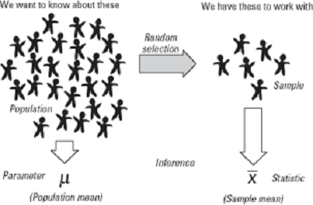
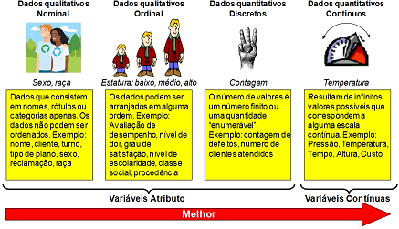
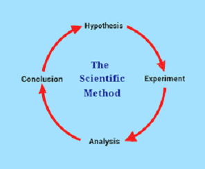
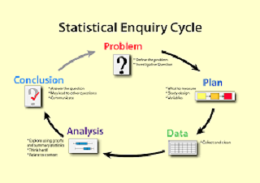
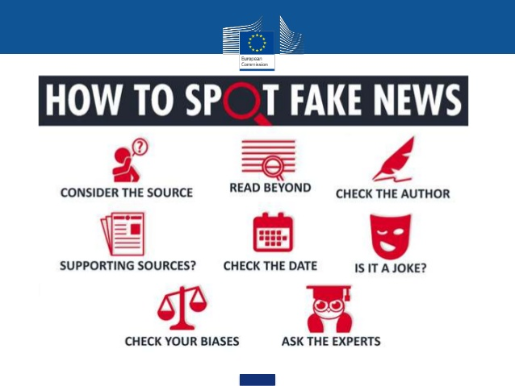

class: inverse, middle, center

```{r libs, echo=FALSE, message=FALSE, warning=FALSE}
library(xaringanExtra)
library(emo)
library(fontawesome)
```


```{r xaringan-logo, echo=FALSE}
# install.packages("remotes")
# remotes::install_github('yihui/xaringan')
# remotes::install_github("gadenbuie/xaringanExtra")
# xaringanExtra::use_logo(
#   image_url = "https://raw.githubusercontent.com/rstudio/hex-stickers/master/PNG/xaringan.png"
# )
use_logo( here::here('img/logo_dest.png'))
```

# Apresentações

---


## O professor esse semestre
* Eu! 

.center[
<iframe src="https://giphy.com/embed/3owzWkGtQ3us1pV0qc" width="480" height="206" frameBorder="0" class="giphy-embed" allowFullScreen></iframe><p><a href="https://giphy.com/gifs/starwars-movie-star-wars-3owzWkGtQ3us1pV0qc">via GIPHY</a></p>
]

---

## O professor esse semestre
### Minha experiência com Estatística `r emo::ji("professor")` 

* Graduação em Estatística em **2006** aqui no DEst, título da monografia *Estudos de Correlação Ecológica - Uma aplicação a dados de saúde em Porto Alegre.*;

* Mestrado em Estatística na **UFMG** com conclusão em **2008**: dissertação intitulada _Testes da Razão de Verossimilhanças em Modelos Lineares Mistos_.

* Ingressei na **UFPEL** em **2009** como Professor Assistente no **Departamento de Matemática e Estatística**.

* Em novembro de **2010** voltei para o **DEst**, onde estou como docente desde então.

---

## O professor nesse semestre
### Minha experiência com Estatística `r emo::ji("professor")[1]`

* Em **2013** fui contemplado com bolsa de estudos e cursei o Doutorado em Estatística da __Universidade de Auckland__, Nova Zelândia; porém não concluí a tese, intitulada provisóriamente *Combining aggregate and individual level data in contingency tables*.

* Continuo minha formação de Doutorado desde **2023** no **Programa de Pós-Graduação em Epidemiologia** da UFRGS. Subtitulo *Improving Odds-Ratio Estimates in Ecological Studies and Case-Control Designs*

* Meus interesses de pesquisa são: **inferência paramétrica**; **teoria de verossimilhança** e **aproximações**, **melhoramentos de testes de hipóteses**, **equações de estimação ponderadas** e análise de dados de **amostragem complexa**.

* Em estatística aplicada: **modelos mistos**, **dados (correlacionados) de área e/ou longitudinais**.  `r emo::ji("stats")`

---

## E sobre vocês? `r emo::ji("student")[1]`
### Sugestões

* Qual o seu nome e curso?  

* Etapa do curso?

* Quantas/quais disciplinas nesse semestre?  

* O que é estatística/amostragem/inferência?  
  + Recenseamento, censo
  
* O que espera da disciplina?

* Possui alguma experiência profisional na área?

* Qual sua cidade?

---

## A disciplina
### Objetivos `r emo::ji("target")`

* Compreender os elementos do estudo estatístico das populações humanas, permitindo a caracterização destes conjuntos de acordo com o seu tamanho e composição, 

  + mensuração das mudanças nos processos dinâmicos da duração da vida e de seus componentes, 

  + relação entre a composição populacional e as suas mudanças. 
  
* Discutir os principais indicadores demográficos. 

* Entender o uso e a necessidade de técnicas de padronização direta e indireta de análise. 

* Avaliar e entender as principais metodologias de estimativas e projeções populacionais que estão à disposição.

---

## A disciplina
### Organização `r emo::ji("professor")`

- __Disciplina:__ Estatística Demográfica
- __Turma:__ U

- __Modalidade:__ Ensino presencial
- __Professor:__ Markus Chagas Stein
    + e-mail: `markus.stein@ufrgs.br` 
    + Sala: B120 do IME

---

## A disciplina
### Aulas e material didático `r emo::ji("notebook")`

- __Aulas__ (teóricas e práticas)
    + Exposição e __discussão__ dos conteúdos
        - __Leituras semanais de artigos e capítulos de livros__
    + Exemplos
    
- __Notas de aula__
    + Slides
    + Rotinas em `r fa("r-project", fill = "steelblue")`

- __Exercícios__
    + Listas de exercícios

---

## A disciplina
### Aulas e material didático `r emo::ji("notebook")`

- __Canais de comunicação:__
    + Durante as aulas
    + Moodle: aulas, materiais e __fórum geral__
    + e-mail do professor

* **Aulas**: segundas e sextas, das 18:30 às 20:10, sala 42 do Prédio de Salas de Aula Campus Centro - 11209
    + _18:30_ chegada
    + _18:40_ início `r emo::ji("clock")`
    + _20h_ fim/dúvidas
    + _20:10_ saída

* **Covid**, **eventos climáticos** e recomendações (Presenças).

---

## A disciplina
### Tecnologias e Linguagem

```{r echo=FALSE, fig.align='center', message=FALSE, warning=FALSE, out.width='55%', paged.print=FALSE}
knitr::include_graphics('https://media.giphy.com/media/CEYYQNKO2HDoc/giphy.gif')
```
*Fonte: [ghipy.com](https://giphy.com/)*


* Exemplos e exercícios com o apoio do computador:
    + `r fa("r-project", fill = "steelblue")` e `RStudio`
    + planilhas eletrônicas
    
---

## A disciplina
### Tecnologias e Linguagem
* `GitHub`, `.Rproj` e `.Rmd`.
	+ revisão(?)


### Porque usar `r fa("r-project", fill = "steelblue")`?
* Aprendemos `r fa("r-project", fill = "steelblue")` para análises estatística, mas `r fa("r-project", fill = "steelblue")` é uma linguagem de programação (geral).

* Ao contrário de linguagens específicas, como `SQL` para manipulação de bases de dados.

* `r fa("r-project", fill = "steelblue")` foi criado na **Universidade de Auckland** em 1993,
  + continua sendo uma das linguagens mais utilizadas porque sua comunidade cresce e desenvolve milhares de pacotes e produtos.

* CRAN

---

## A disciplina
### Conteúdo programático `r emo::ji("document")`

* __Área 1__ - *Campo, Objeto e Métodos da Demografia, Fontes de dados demográficos*

    + Definição de demografia; Demografia e estatística; Breve histórico e teorias demográficas; Tamanho e composição da população; A dinâmica global da população; Tipos de população; Crescimento populacional e seus componentes; Medidas demográficas estatísticas; Tempo de duplicação de uma população; Conceito de coorte.
    
    + Censos; Registro civil; Pesquisas por amostragem; Quantidade e qualidade dos dados.

---

## A disciplina
### Conteúdo programático `r emo::ji("document")`

* __Área 2__ - *Mortalidade e Tábuas de Vida*	

    + Medidas de mortalidade: taxas brutas e específicas; métodos de padronização; mortalidade infantil e seus componentes; mortalidade por causa específica; mortalidade materna; anos potenciais de vida perdidos.
    
    + Construindo uma Tábua de Vida; Tábua de Vida abreviada; As funções de uma Tábua de Vida; Riscos Competitivos; Construção da Tábua de Vida de múltiplo decremento.

---

## A disciplina
### Conteúdo programático `r emo::ji("document")`

* __Área 3__ - *Fecundidade e Reprodução, Projeções Populacionais	e Avaliação da qualidade de dados demográficos*	

    + Medidas de fecundidade: taxa bruta de natalidade; taxa de fecundidade geral; taxa específica de fecundidade; taxa de fecundidade total; Medidas de reprodução: taxa bruta de reprodução; taxa líquida de reprodução.

    + Aplicações das projeções; Estimativas, projeções e previsões; Metodologias de projeção populacional: métodos de crescimento populacional; método dos componentes.

    + Métodos para identificar erros de cobertura de nascidos vivos, óbitos e classificação da qualidade de registros vitais; Completude das declarações dos registros vitais, causas mal definidas e garbage codes; Causas de mortes desconhecidas.

<center>
**Ler o Plano de Ensino e Instruções Gerais `r emo::ji("document")`**
<center>

<!-- - Conteúdo programático `r emo::ji("document")` -->

---
    
## A disciplina
### Avaliação `r emo::ji("bomb")`

- Serão realizadas quatro atividades de avaliação (pelo menos uma em de cada área):
    + três provas ($P_1$, $P_2$ e $P_3$) presenciais e individuais;
    + um trabalho em grupo ($T$), ou a média de outras atividades parciais.
    
- Cada atividade de avaliação vale 10 pontos

- Será realizado uma prova presencial e individual como atividade de recuperação ($P_R$)
    + Para os alunos que não atingirem o conceito mínimo
    + __Esta prova abrange todo o conteúdo da disciplina__

---

## A disciplina
### Avaliação `r emo::ji("mark")`

$$
MF = \frac{P_1 + P_2 + P_3 + T}{4}
$$

+ __A:__ $9 \leq MF \leq 10$
+ __B:__ $7,5 \leq MF < 9$
+ __C:__ $6 \leq MF < 7,5$
+ __D:__ $MF < 6$
+ __FF:__ se o aluno tiver frequência inferior a 75% da carga horária prevista no plano da disciplina

---

## A disciplina
### Avaliação `r emo::ji("bomb")`

+ Se $MF < 6$ e frequência mínima de 75% o aluno poderá realizar a prova de recuperação e neste caso

$$
MF' = MF \times 0,4 + P_R \times 0,6
$$

__Conceitos após a recuperação:__

- __C:__ $MF' \geq 6$
- __D:__ $MF' < 6$

---

## A disciplina
### Datas das avaliações `r emo::ji("calendar")`

* $P_1$: 08/04/2026
* $P_2$: 20/05/2026
* $P_3$: 01/07/2026
* $T$: a definir 
* $P_R$: 08/07/2026

### Tempo (esperado) de dedicação `r emo::ji("time")`
* aulas presenciais - **4h semanais**
* listas de exercícios, laboratórios e revisão - **4h semanais** `r emo::ji("1st_place_medal")`

---

## A disciplina
### Referências bibliográficas (principais)`r emo::ji("book")[1]`

```{r echo=FALSE, fig.align='right', message=FALSE, warning=FALSE, out.width='15%', paged.print=FALSE}
# knitr::include_graphics(here('images','ctanlion.png'))
```


* [FOZ,Grupo de. Métodos Demográficos: Uma Visão Desde os Países de Língua Portuguesa. SãoPaulo:Blucher,2021.](https://www.blucher.com.br/metodos
demograficos-uma-visao-desde-os-paises-de-lingua-portuguesa_9786555500837)

* Hakker, Ralph. Fontes de Dados Demográficos. Belo Horizonte: ABEP, 1996. Disponível em: http://www.abep.nepo.unicamp.br/docs/outraspub/textosdidaticos/tdv03.pdf

* Marilene Dias Bandeira. Estatística demográfica I. Porto Alegre: UFRGS: Instituto de Matemática, Departamento de Estatística, 2009(Polígrafo da Disciplina MAT02262).. Porto Alegre, 2009.


```{r echo=FALSE, fig.align='center', message=FALSE, warning=FALSE, out.width='20%', paged.print=FALSE}
knitr::include_graphics(here::here('aulas/imagens', 'livro_metodos.png'))
```

---

class: inverse, middle, center

# Dúvidas, sugestões, críticas, ...? `r emo::ji("question")[1]`

---

class: inverse, middle, center

# O que é Estatística Demográfica?

---

## O que é Estatística Demográfica?

### O que sabemos sobre Probabilidade e Estatística?  

* Probabilidade e Estatística = introdução à:
  + Estatística descritiva + 
  + Teoria da probabilidade +
  + Inferência Estatística

```{r echo=FALSE, message=FALSE, warning=FALSE, out.width='40%', fig.show="hold"}
knitr::include_graphics(here::here('aulas/imagens', 'egyptian.jfif'))
knitr::include_graphics(here::here('aulas/imagens', 'bayesian_evol.png'))
```

---

## O que é Estatística Demográfica?
### O que é Probabilidade e Estatística?
     
 

---

## O que é Estatística Demográfica?

### Conceitos básicos

**Estatística**  
* descritiva $\times$ inferencial
  + Populacional $\times$ Amostral

**Estatística Demográfica**  

<!-- {width=1%} -->

```{r echo=FALSE, fig.align='center', message=FALSE, warning=FALSE, out.width='50%', paged.print=FALSE}
knitr::include_graphics(here::here('aulas/imagens', 'imagem_demografica.png'))
```


---

## O que é Estatística Demográfica?

### Conceitos básicos

**População**  
- unidades experimentais / observacionais  
- **dados** são informações obtidas de uma unidade experimental/observacional  
  
<!-- &nbsp; -->

**Amostra**  
- aleatória ou por conveniência?

<!-- &nbsp; -->

**Parâmetro** ( $\mu$, $\sigma^2$, $\pi$ ...) $\times$ **Estatística** ( $\bar{x}$, $s^2$, $p$, ...)

<!-- &nbsp; -->

<center>

<center>

---

## O que é Estatística Demográfica?

#### Conceitos básicos

**Variável** = Característica de uma unidade experimental  
- resultados que variam de um indíviduo para outro

**Tipos de variáveis**    

- **quantitativas**:  
discreta $\times$ contínua  
  
- **qualitativas (categórica)**:  
nominal $\times$ ordinal  

&nbsp;

<center>

<center>

<!-- ## De modo geral -->
<!-- * teoria de **amostragem** = **planejamento** + **obtenção** + **análise**   -->
<!-- de dados amostrais obtidos de populações finitas. -->

<!-- *Em amostragem 2 estudamos diferentes formas de obtenção de dados e (des)vantajem em relação à AAS.* -->

<!-- * **Model** *versus* **design** *approach* -->
<!--   + *verossimilhança* $\times$ *equação de estimação ponderada*? -->
<!--   + v.a.: $Y_i \sim f(y,\theta)$ ou $R_i \in \left\{ 0, 1\right\}$(?). -->

<!-- --- -->

<!-- ## O que é Amostragem 2? -->
<!-- * Análise de dados de amostras dependentes (possivelmente) com probabilidades desiguais de seleção. -->

<!-- * Na prática pesquisas utilizam a combinação de -->
<!-- 	+ AAS (ou sistemática) -->
<!-- 	+ estratos -->
<!-- 	+ *clusters* -->

<!-- * Aspectos computacionais -->
<!-- 	+ tradicionalmente livros de amostragem focam nas diferentes configurações -->
<!-- 	+ computacionalmente é mais eficiente implementar o caso geral (de equações de estimação ponderadas) -->


---

## O que é Estatística Demográfica?

### Institutos/Organizações

* Institutos no Brasil
  + [IBGE - Instituto Brasileiro de Geografia e Estatística](https://ibge.gov.br/)
  + [DEE/RS - Departamento de Economia e Estatística](https://dee.rs.gov.br/inicial) (Extinta FEEE - FUndação de Economia e Estatística)

* [Abep - Associação Brasileira de Estudos Populacionais](https://abep.org.br/)

* Exemplo Instituto no Exterior  
  + [StatsNZ - Statistics New Zealand](https://www.stats.govt.nz/)
  + [StatsCan - Statistics Canada](https://www.statcan.gc.ca/en/start)

* Associações do Insituto Internacional de Estatística (ISI) ligadas a Demografia
  + [IAOS/ISI - International Association for Official Statistics](https://iaos-isi.org/)
  + [IASS/ISI - International Association of Survey Statisticians](http://isi-iass.org/home/)

---

## O que é Estatística Demográfica?

### Na prática - Fontes de Dados Amostrais

* Exemplos de Pesquisas/survey do IBGE
  + [PNS - Pesquisa Nacional de Saúde](https://www.ibge.gov.br/estatisticas/sociais/saude/9160-pesquisa-nacional-de-saude.html?=&t=o-que-e) 
  + [POF - Pesquisa de Orçamentos Familiares](https://www.ibge.gov.br/pof2024/)
  + [PNAD - Pesquisa Nacional por Amostras de Domicílios](https://www.ibge.gov.br/estatisticas/sociais/trabalho/9171-pesquisa-nacional-por-amostra-de-domicilios-continua-mensal.html?=&t=o-que-e) 
  + [PeNSE - Pesquisa Nacional de Saúde do Escolar](https://www.ibge.gov.br/estatisticas/sociais/saude/9134-pesquisa-nacional-de-saude-do-escolar.html?=&t=o-que-e)

* PED do DEE? (no tempo da FEEE era https://arquivofee.rs.gov.br/publicacoes/ped-rmpa/)

---

## O que é Estatística Demográfica?
### Na prática - Fontes de Dados Populacionais

* [Censo Demográfico - IBGE](https://www.ibge.gov.br/estatisticas/sociais/saude/22827-censo-demografico-2022.html)

* Registro civil/cartórios
  + Nascimentos, óbitos, casamentos,... (?)

* Sistema de Informação em Saúde - [DATASUS](https://datasus.saude.gov.br/)
  + SIM (Sistema de Informações sobre Mortalidade): Coleta dados sobre óbitos (fetais e gerais) via Declaração de Óbito (DO).
  + SINASC (Sistema de Informações sobre Nascidos Vivos): Processa dados de natalidade em todo o território nacional.

* O que mais podemos ter?


---

## O que é Estatística Demográfica?

* Busca de notícias com a palavra `demográfica`

```{r echo=FALSE, fig.align='center', message=FALSE, warning=FALSE, out.width='60%', paged.print=FALSE}
knitr::include_graphics(here::here('aulas/imagens', 'noticias_crise_demografica.png'))
```


<!-- --- -->

<!-- ## Na prática -->
<!-- * *Epicovid*  -->
<!--   + EPIDEMIOLOGIA DA COVID-19 NO RIO GRANDE DO SUL: Estudo de base populacional - https://wp.ufpel.edu.br/covid19/files/2020/09/Coletiva-RS-Fase-8-20200908_v2.pdf -->
<!--   + *Estimando a prevalência de covid19 no RS* - https://github.com/markus-stein/MCML-notes/blob/master/covid-prevalence_RS/prevalencia_covid19_RS2.pdf -->

<!-- * Artigo caso-controle e Covid no RS -->
<!--   + *Social Distancing, Mask Use and the Transmission of SARS-CoV-2: A Population-Based Case-Control Study* - https://papers.ssrn.com/sol3/papers.cfm?abstract_id=3731445 -->
<!--   + https://github.com/markus-stein/MCML-notes/blob/master/case-control_mask-use_and-covid/case-control_mask-use-and-covid.txt -->

<!-- * Tenho também alguma experiência em análise de dados caso-controle em epidemiologia veterinária. -->

<!-- --- -->

<!-- ## Viéses em amostragem -->
<!-- Definição de viés:   -->

<!-- * Dicionário Priberam - https://dicionario.priberam.org/vi%C3%A9s -->
<!-- * Cambridge dictionary - https://dictionary.cambridge.org/dictionary/english/bias -->

<!-- ```{r echo=FALSE, fig.align='center', message=FALSE, warning=FALSE, out.width='50%', out.height='50%', paged.print=FALSE} -->
<!-- knitr::include_graphics(here::here('img', 'bias-marketing-survey.png')) -->
<!-- ``` -->
<!-- Fonte: https://www.adweek.com/agencies/6-ways-you-might-be-unintentionally-introducing-bias-into-your-marketing-surveys/ -->

<!-- --- -->

<!-- ## Viéses em pesquisas -->
<!-- ### **Nonresponse - Interviewer bias** -->
<!-- ```{r echo=FALSE, fig.align='center', message=FALSE, warning=FALSE, out.width='50%', out.height='50%', paged.print=FALSE} -->
<!-- knitr::include_graphics(here::here('img', 'halloween-pollster.jpg')) -->
<!-- ``` -->
<!-- Fonte: https://blog.cruxresearch.com/2013/08/27/the-top-5-errors-and-biases-in-survey-research/ -->

<!-- --- -->

<!-- ## Viéses em pesquisas -->
<!-- ### **Response bias** -->
<!-- ```{r echo=FALSE, fig.align='center', message=FALSE, warning=FALSE, out.width='70%', out.height='70%', paged.print=FALSE} -->
<!-- knitr::include_graphics(here::here('img', 'response_bias.png')) -->
<!-- ``` -->
<!-- Fonte: https://www.zef.fi/blog/response-bias-its-cramping-your-survey-style -->

<!-- --- -->

<!-- ## Viéses em pesquisas -->
<!-- ### **Questionnaire bias** -->
<!-- ```{r echo=FALSE, fig.align='center', message=FALSE, warning=FALSE, out.width='40%', out.height='40%', paged.print=FALSE} -->
<!-- knitr::include_graphics(here::here('img', 'questionnaire_bias.jpg')) -->
<!-- ``` -->
<!-- Fonte: https://news.nnlm.gov/nec/2017/03/06/the-dark-side-of-questionnaires-how-to-identify-questionnaire-bias/ -->

---

class: inverse, middle, center

# Por fim

---
## Coisas que acredito...

* Estatística é uma disciplina que pode diferenciar nosso currículo 
  + ferramentas que auxiliam desde a coleta de dados até a tomada de decisão 
	+ além de formar cidadã(o)s mais conscientes 

* Porque estudar essa disciplina?
	+ estimular o pensamento critico sobre o planejamento, obtencao, análise de dados e conclusões
	+ desenvolver análises e conclusões rigorosamente seguindo a teoria
	+ flexibilidade para trabalhar com dados na vida real




---

## Coisas que acredito...



---

## Sejam bem-vinda(o)s!

### Próxima aula

Ler Capítulo 1 do livro [FOZ,Grupo de. Métodos Demográficos: Uma Visão Desde os Países de Língua Portuguesa. SãoPaulo:Blucher,2021.](https://www.blucher.com.br/metodos
demograficos-uma-visao-desde-os-paises-de-lingua-portuguesa_9786555500837).  

### Dúvidas, sugestões, críticas, ... `r emo::ji("question")[1]`

<center>
**Bom semestre para nós!**
<center>

```{r echo=FALSE, fig.align='center', message=FALSE, warning=FALSE, out.width='50%', paged.print=FALSE}
knitr::include_graphics(here::here('aulas/imagens', 'imagem_demografica.png'))
```

<!-- --- -->

<!-- ## Links -->

<!-- - SABI+: http://sabi.ufrgs.br/ ""   -->
<!-- - `r fa("r-project", fill = "steelblue")`: https://www.r-project.org/   -->
<!-- - RStudio: https://www.rstudio.com/   -->
<!-- - site da disciplina Probabilidade e Estatística EAD: https://www.ufrgs.br/probabilidade-estatistica/ -->
<!-- - canal do youtube: https://www.youtube.com/c/ProbabilidadeeEstatísticaUFRGS -->